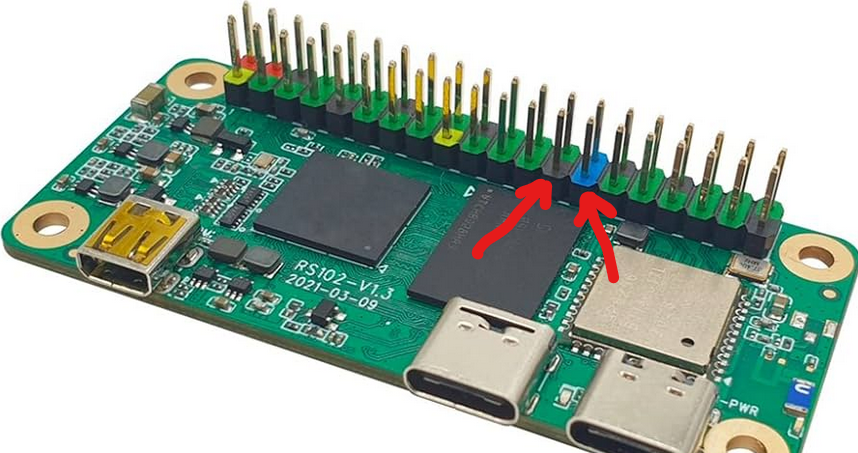

# OpenIPC Wiki
[Table of Content](../README.md)

OpenIPC FPV ground station
--------------------------

<p align="center">
  
</p>

Here is a good [getting started](https://wiki.radxa.com/Zero/getting_started) if you are not familiar with Radxa. 

# OpenIPC VRX Enclosures Documentation

This documentation provides a list of enclosures for OpenIPC VRX setups, available from various makers. Click on each link to view or download the enclosure files and instructions.

## Enclosure Models

1. [OpenIPC VRX Enclosure](https://www.printables.com/model/1051224-openipc-vrx-enclosure)
2. [OpenIPC Radxa GS Case](https://www.printables.com/model/967795-openipc-radxa-gs-case)
3. [Another OpenIPC Radxa GS Case](https://www.printables.com/model/979788-another-openipc-radxa-gs-case)
4. [OpenIPC GS Case V1](https://www.printables.com/model/1034290-openipc-gs-case-v1)
5. [A Case for the OpenIPC GS](https://www.printables.com/model/988543-a-case-for-the-openipc-gs)
6. [Radxa Zero 3W GS Box](https://www.printables.com/model/822826-radxa03w-gs_box)
7. [OpenIPC Radxa Zero 3W HDMI Ground Station](https://www.printables.com/model/1020246-openipc-radxa-zero-3w-hdmi-ground-station)
8. [Radxa Zero 3W Case for OpenIPC](https://www.printables.com/model/1054879-radxa-zero-3w-case-for-openipc)
9. [OpenIPC VRX Case on Thingiverse](https://www.thingiverse.com/thing:6680584)

---

Each link directs you to the appropriate 3D model site, where you can access STL files, printing details, and additional images of the VRX enclosures.

### Flashing 

* SDCard
[Link](https://github.com/OpenIPC/sbc-groundstations/releases) to latest

* EMMC
[How to flash the image to your onboard emmc](https://github.com/OpenIPC/sbc-groundstations/blob/master/radxa_pi_zero_3w/flashing_to_the_onboard_memory.md)


### Wifi

You can [setup the onboard wifi](https://github.com/OpenIPC/sbc-groundstations/blob/master/radxa_pi_zero_3w/headless_setup.md#setup-of-autoconnect-on-boot) for SSH connectivity. (udev rules and networkmanager are already configured in this image, you only need to execute the nmcli commands)

Note: for RubyFPV you will either need a USB Network Dongle like the one below

 

or access serial console, please check [here](https://wiki.radxa.com/Zero/dev/serial-console) on how to do that.

### DVR with FPV firmware

DVR functionality; It requires a push button to be installed to the gpio header between physical pins 25 and 27 like so:




To record DVR, push the button once. The stream will start and DVR will begin recording. When finished, push the button once to stop the recording and save the file.

DVR is saved to the Videos folder in your home directory. DVR can be accessed either at /home/radxa/Videos or via a media server. Connect your groundstation to your home network and it can be accessed via a web browser at x.x.x.x:8080 -- replace x.x.x.x with your groundstation's local ip address.

Connect Led long lead to +5v, Led short lead via a 1k resistor to GPIOAO_2 (The other BLUE pin on Radxa),

```bash
sudo gpioset gpiochip4 11=0      # turn LED on
sudo gpioset gpiochip4 11=1      # turn LED off (actually it is very                             # simply lit because i guess logic level 0 is not 0 volts)
```

Circuit wiring:  +5v —>  +Led- —-> 1k resistor —> pin 28 on Radxa z3w (aka the other blue pin)

<hr>

A note about the DVR recording in this image. To ease the strain on the processor, we record to to a ts file rather than mp4 or mkv. As a result, there is no "smear" effect recorded, the uncaptured frames are simply dropped. You may notice jumps in your recording where there was no frame information.

### Links to some helpful tools

* [Windows Tools](https://dl.radxa.com/zero/tools/windows/)
* [Other, All OS](https://dl.radxa.com/tools/)

### RubyFPV
see [RubyFPV Hardware](https://rubyfpv.com/hardware.php)
